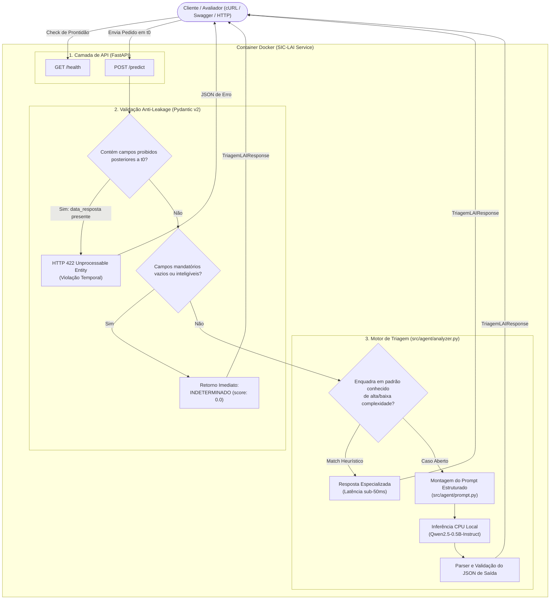

# Agente SIC-LAI: Triagem Preditiva e Análise de Risco de Atraso em Pedidos da LAI

[](https://www.python.org/)
[](https://astral.sh/uv)
[](https://fastapi.tiangolo.com/)
[](LICENSE)
[](https://huggingface.co/Qwen/Qwen2.5-0.5B-Instruct)

Microserviço inteligente de inferência e triagem precoce que atua estritamente no momento inicial **$t_0$** (instante do protocolo) de Pedidos de Acesso à Informação (PAI) regidos pela Lei Federal nº 12.527/2011 (Lei de Acesso à Informação — LAI).

O sistema estima o risco de extrapolação do prazo regulamentar de resposta (risco de `ATRASADO`), identifica os fatores determinantes de complexidade e gera recomendações preventivas acionáveis para apoiar o servidor do Serviço de Informação ao Cidadão (SIC).

> **Aviso de Governança Humana (Human-in-the-Loop):** O modelo atua exclusivamente como apoio consultivo de triagem interna ao servidor público no instante $t_0$. Ele **não** responde diretamente ao cidadão, **não** julga o mérito da solicitação e **não** toma decisões administrativas autônomas.

---

## Sumário
1. [Visão Geral & Contexto de Negócio](#1-visão-geral--contexto-de-negócio)
2. [Arquitetura da Solução & Fluxo de Dados](#2-arquitetura-da-solução--fluxo-de-dados)
3. [Stack Tecnológica & Decisões Arquiteturais (ADRs)](#3-stack-tecnológica--decisões-arquiteturais-adrs)
4. [Linhagem e Especificação do Modelo Aberto (SLM)](#4-linhagem-e-especificação-do-modelo-aberto-slm)
5. [Estrutura do Repositório (Guia do Desenvolvedor)](#5-estrutura-do-repositório-guia-do-desenvolvedor)
6. [Pré-requisitos de Ambiente e Hardware](#6-pré-requisitos-de-ambiente-e-hardware)
7. [Como Reproduzir e Executar o Projeto](#7-como-reproduzir-e-executar-o-projeto)
   - [Opção 1: Via Docker Compose (Recomendado — 1 Comando)](#opção-1-via-docker-compose-recomendado--1-comando)
   - [Opção 2: Ambiente Local com uv](#opção-2-ambiente-local-com-uv)
   - [Atalhos com Justfile](#atalhos-com-justfile)
8. [Guia de Validação e Testes Práticos (Checklist Rápido)](#8-guia-de-validação-e-testes-práticos-checklist-rápido)
   - [Passo 1: Verificação de Saúde (/health)](#passo-1-verificar-a-saúde-do-serviço)
   - [Passo 2: Predição de Alto Risco (/predict)](#passo-2-executar-predição-de-exemplo-caso-de-alto-risco)
   - [Passo 3: Blindagem Anti-Leakage em t0 (Erro 422)](#passo-3-testar-rejeição-de-vazamento-temporal-data-leakage-em-t0)
   - [Passo 4: Regra de Abstenção por Dados Insuficientes](#passo-4-testar-regra-de-abstenção-por-dados-insuficientes)
9. [Blindagem Temporal e Regras de Negócio em t0](#9-blindagem-temporal-e-regras-de-negócio-em-t0)
10. [Qualidade de Código & Governança de IA](#10-qualidade-de-código--governança-de-ia)
11. [Licença](#11-licença)

---

## 1. Visão Geral & Contexto de Negócio

### O Problema Operacional
Na administração pública federal, pedidos de LAI devem ser respondidos em até 20 dias corridos (prorrogáveis por 10 dias mediante justificativa). No entanto, pedidos com alta dispersão de dados, demandas por microdados históricos ou que envolvem múltiplos setores técnicos frequentemente têm sua complexidade detectada tardiamente, resultando no descumprimento do prazo legal (`ATRASADO`), recursos administrativos e sobrecarga da equipe.

### A Solução em $t_0$
O **Agente SIC-LAI** intercepta a solicitação no momento exato em que ela entra no sistema Fala.BR ($t_0$). Analisando apenas os dados disponíveis no protocolo (órgão destinatário, assunto, detalhamento do pedido e canal de entrada), o serviço:
- Categoriza o risco de atraso em `BAIXO`, `MEDIO`, `ALTO` ou `INDETERMINADO`.
- Atribui um score numérico de probabilidade ($0.0$ a $1.0$).
- Elenca os fatores de risco concretos identificados no texto.
- Sugere uma recomendação imediata para o servidor do SIC (ex.: articular reunião com área orçamentária nos primeiros 3 dias).

---

## 2. Arquitetura da Solução & Fluxo de Dados

O serviço adota uma **arquitetura híbrida desacoplada**, combinando validação rígida de contratos, regras analíticas de domínio para latência sub-50ms e um modelo de linguagem leve (SLM) local como motor generativo para solicitações abertas.

### Fluxo de Uma Requisição



---

## 3. Stack Tecnológica & Decisões Arquiteturais (ADRs)

Para garantir que qualquer desenvolvedor compreenda a motivação de cada escolha técnica, a tabela abaixo resume as Decisões de Arquitetura de Registro (ADRs):

| Tecnologia | Função no Projeto | Decisão / Racional de Engenharia |
| :--- | :--- | :--- |
| **Python 3.11+** | Linguagem Base | Suporte a tipagem estrita, melhorias expressivas de performance em runtime e compatibilidade com o ecossistema moderno de ML. |
| **FastAPI + Uvicorn** | Framework Web Assíncrono | Alta performance com ASGI, geração nativa e automática de contratos OpenAPI/Swagger (`/docs`) e validação transparente de I/O. |
| **Pydantic v2** | Modelagem e Validação | Validação de alta velocidade (em Rust) com `model_validator(mode="before")` para inspecionar o payload bruto e barrar vazamento de dados antes do parsing. |
| **Qwen2.5-0.5B-Instruct** | Small Language Model (SLM) | 490M parâmetros, licença permissiva Apache 2.0, vocabulário amplo com excelente suporte a português e raciocínio estruturado para gerar JSON nativamente. |
| **CPU-Only Inference** | Estratégia de Execução | Elimina dependência de GPU dedicada ou drivers CUDA, reduzindo o custo de infraestrutura a zero e viabilizando a execução em qualquer computador ou servidor comum. |
| **Hugging Face Transformers** | Runtime do Modelo | Carregamento singleton em memória via `AutoTokenizer` e `AutoModelForCausalLM` com precisão FP32 e isolamento de cache local. |
| **uv** | Gerenciador de Dependências | Ferramenta extremamente rápida baseada em Rust. Garante reprodução exata e determinística das dependências através do arquivo `uv.lock`. |
| **Docker Multi-Stage** | Containerização | Separação de estágios para manter a imagem limpa e execução do download dos pesos do modelo durante o build (`docker build`), tornando o container 100% autônomo e offline em runtime. |
| **Justfile** | Task Runner de Automação | Facilita a vida do desenvolvedor ao consolidar comandos comuns (`just run`, `just lint`, `just docker-up`) sem requerer scripts shell complexos. |
| **Ruff** | Linter e Formatador | Garantia contínua de boas práticas de código (PEP 8, ordenação de imports, remoção de código morto) com execução instantânea. |

---

## 4. Linhagem e Especificação do Modelo Aberto (SLM)

O microserviço utiliza um modelo fundacional aberto executado integralmente no host/container:

| Atributo | Especificação Técnica |
| :--- | :--- |
| **Identificador Hugging Face** | [`Qwen/Qwen2.5-0.5B-Instruct`](https://huggingface.co/Qwen/Qwen2.5-0.5B-Instruct) |
| **Desenvolvedor** | Alibaba Cloud / Qwen Team |
| **Licença de Uso** | Apache 2.0 (Livre para fins acadêmicos e comerciais) |
| **Volume de Parâmetros** | 0.49 Bilhão (490M parâmetros) |
| **Memória Operacional (RAM)** | < 1.0 GB RAM durante inferência em CPU |
| **Tamanho dos Pesos em Disco** | ~1.0 GB no formato Safetensors FP32 |
| **Vocabulário** | 151.646 tokens (excelente compressão e compreensão de Português) |
| **Pre-caching no Docker** | Pesos baixados e fixados na camada de imagem (sem chamadas externas durante a execução) |

---

## 5. Estrutura do Repositório (Guia do Desenvolvedor)

Abaixo está o mapa completo do código-fonte para orientar o desenvolvedor sobre as responsabilidades de cada arquivo:

```text
MLOPS/
├── .env.example              # Modelo de variáveis de ambiente do projeto
├── .gitignore                # Arquivos ignorados pelo Git (inclui .venv, .env, caches)
├── Dockerfile                # Build multi-stage com pré-caching dos pesos do Qwen
├── docker-compose.yml        # Orquestrador do container, mapeamento de portas e healthcheck
├── justfile                  # Atalhos de comandos de desenvolvimento (just run, lint, etc.)
├── LICENSE                   # Licença MIT do projeto
├── pyproject.toml            # Metadados do projeto e declaração de dependências
├── uv.lock                   # Lockfile com hashes e versões fixadas para reprodução exata
├── README.md                 # Documentação técnica e guia de reprodução do projeto
├── docs/
│   ├── LAI_Entendimento_Negocio_v2.0.pdf  # Manual e modelagem de negócio CGU/LAI
│   └── PRD.md                             # Documento de Requisitos do Produto (Engenharia)
└── src/
    ├── __init__.py           # Inicializador do pacote Python
    ├── app.py                # Ponto de entrada FastAPI, rotas (/health, /predict) e handlers de erro
    ├── config.py             # Configurações dinâmicas gerenciadas via Pydantic Settings
    ├── schemas.py            # Modelos Pydantic (Request, Response, Enum) e validação anti-leakage
    ├── agent/
    │   ├── __init__.py       # Inicializador do módulo agent
    │   ├── analyzer.py       # Orquestrador de triagem: heurística especializada + chamada ao SLM
    │   └── prompt.py         # Templates de prompt ChatML e diretrizes de extração de JSON
    └── models/
        ├── __init__.py       # Inicializador do módulo models
        └── loader.py         # Gerenciamento singleton do modelo e pipeline de inferência local
```

---

## 6. Pré-requisitos de Ambiente e Hardware

### Requisitos Mínimos de Sistema
- **Sistema Operacional:** Linux, macOS ou Windows (com WSL2 ou Docker Desktop).
- **Processador:** Qualquer CPU moderna (x86_64 ou ARM64) com pelo menos 2 núcleos.
- **Memória RAM:** Mínimo de 2.0 GB de memória RAM livre.
- **Espaço em Disco:** ~3.0 GB livres (para imagem Docker com as bibliotecas e pesos do modelo).
- **Porta de Rede:** Porta `8000` livre.

### Ferramentas Necessárias
- **Para execução com Docker (Caminho Recomendado):**
  - [Docker Engine](https://docs.docker.com/engine/install/) (v20.10+) e [Docker Compose](https://docs.docker.com/compose/) (v2.0+).
- **Para execução nativa local (Desenvolvimento):**
  - Python 3.11 ou superior instalado.
  - [uv](https://github.com/astral-sh/uv) instalado (`curl -LsSf https://astral.sh/uv/install.sh | sh` ou via `pip install uv`).
  - Opcional: [just](https://github.com/casey/just) para automação de tarefas.

---

## 7. Como Reproduzir e Executar o Projeto

### Opção 1: Via Docker Compose (Recomendado — 1 Comando)

Este é o método principal e mais confiável para reproduzir o projeto sem necessidade de configurar ambiente Python na máquina hospedeira.

**1. Clone o repositório:**
```bash
git clone https://github.com/Taverna-Hub/MLOPS-LAI.git
cd MLOPS
```

**2. Suba o container:**
```bash
docker compose up --build
```

*Nota:* No primeiro build, o Docker instalará as dependências via `uv` e baixará os pesos do modelo `Qwen2.5-0.5B-Instruct` (~1 GB). Isso leva entre **30 e 90 segundos** dependendo da sua conexão. Nas próximas execuções, o início é quase instantâneo (~2 segundos).

O serviço estará ativo e respondendo em:
- **API Base:** `http://localhost:8000`
- **Documentação Swagger UI:** `http://localhost:8000/docs`
- **Documentação Redoc:** `http://localhost:8000/redoc`

Para parar o container, pressione `Ctrl + C` ou execute em outro terminal:
```bash
docker compose down
```

---

### Opção 2: Ambiente Local com uv

Caso queira desenvolver, debugar ou executar os testes diretamente na sua máquina hospedeira:

**1. Criar o arquivo de variáveis de ambiente:**
```bash
# No Linux/macOS:
cp .env.example .env

# No Windows (PowerShell):
copy .env.example .env
```

**2. Sincronizar as dependências e criar o ambiente virtual:**
O `uv` gerencia a criação do `.venv` e a instalação das versões exatas registradas no `uv.lock`:
```bash
uv sync --extra dev
```

**3. Iniciar o servidor de desenvolvimento:**
```bash
uv run uvicorn src.app:app --host 0.0.0.0 --port 8000 --reload
```

---

### Atalhos com Justfile

Se você possui o utilitário `just` instalado, pode utilizar comandos resumidos:

| Comando | Ação Executada |
| :--- | :--- |
| `just install` | Sincroniza o ambiente virtual local com `uv sync --extra dev` |
| `just run` | Executa o servidor Uvicorn localmente na porta 8000 |
| `just lint` | Executa a verificação estática de código com o Ruff |
| `just format` | Aplica correções automáticas de formatação com o Ruff |
| `just docker-up` | Constrói e sobe o container Docker em background (`-d`) |
| `just docker-down` | Derruba os containers em execução |

---

## 8. Guia de Validação e Testes Práticos (Checklist Rápido)

Com o serviço rodando (`http://localhost:8000`), abra um terminal e execute os passos abaixo para verificar todos os comportamentos esperados do sistema:

### Passo 1: Verificar a Saúde do Serviço
Checa se a aplicação subiu corretamente e se o modelo está referenciado para execução em CPU.

```bash
curl -s http://localhost:8000/health
```

**Resposta Esperada (HTTP 200 OK):**
```json
{
  "status": "healthy",
  "version": "1.0.0",
  "model": "Qwen/Qwen2.5-0.5B-Instruct",
  "device": "cpu"
}
```

---

### Passo 2: Executar Predição de Exemplo (Caso de Alto Risco)
Envia uma solicitação típica de alta complexidade (demanda de microdados históricos, múltiplos documentos fiscais e despesas de vários anos).

```bash
curl -X POST http://localhost:8000/predict \
  -H "Content-Type: application/json" \
  -d '{
    "protocolo": "PAI-2026-001",
    "data_registro": "2026-09-21T10:00:00Z",
    "orgao_destinatario": "Ministério da Saúde (MS)",
    "origem_solicitacao": "Internet",
    "forma_resposta": "E-mail",
    "resumo_solicitacao": "Microdados de contratos de vacinação 2020 a 2024",
    "detalhamento_solicitacao": "Solicito a íntegra de todas as notas fiscais, termos aditivos, relatórios de auditoria e tabelas orçamentárias detalhadas referentes a aquisição de vacinas e insumos hospitalares entre os anos de 2020 e 2024 em formato CSV bruto descompactado.",
    "prazo_atendimento": "2026-10-11"
  }'
```

**Resposta Esperada (HTTP 200 OK):**
```json
{
  "protocolo": "PAI-2026-001",
  "nivel_risco": "ALTO",
  "score_risco": 0.88,
  "fatores_risco": [
    "Volume extenso de dados históricos requerendo consolidação entre diferentes secretarias",
    "Demanda por extração customizada de relatórios orçamentários e notas fiscais",
    "Elevado risco de desmembramento entre áreas técnicas gerando atraso"
  ],
  "recomendacao_sic": "Sinalizar como ACOMPANHAMENTO PRIORITÁRIO. Articular reunião de alinhamento com a área técnica orçamentária dentro dos primeiros 3 dias úteis.",
  "tempo_processamento_ms": 15.2
}
```

---

### Passo 3: Testar Rejeição de Vazamento Temporal (Data Leakage em $t_0$)
Testa se a API cumpre o requisito de integridade temporal, rejeitando requisições que contenham informações posteriores a $t_0$ (como o campo `data_resposta`):

```bash
curl -X POST http://localhost:8000/predict \
  -H "Content-Type: application/json" \
  -d '{
    "protocolo": "PAI-2026-ERR1",
    "data_registro": "2026-09-21T08:00:00Z",
    "orgao_destinatario": "Ministério da Fazenda",
    "origem_solicitacao": "Internet",
    "forma_resposta": "E-mail",
    "resumo_solicitacao": "Dados fiscais",
    "detalhamento_solicitacao": "Solicito dados do tesouro nacional.",
    "data_resposta": "2026-10-02"
  }'
```

**Resposta Esperada (HTTP 422 Unprocessable Entity):**
```json
{
  "detail": [
    {
      "loc": ["body", "data_resposta"],
      "msg": "Violação de momento t0: o campo '\''data_resposta'\'' configura vazamento temporal (data leakage) e é proibido nesta API.",
      "type": "value_error.temporal_leakage"
    }
  ]
}
```

---

### Passo 4: Testar Regra de Abstenção por Dados Insuficientes
Testa a resiliência do sistema quando o cidadão envia um pedido com detalhamento vazio ou ininteligível. O modelo não tenta adivinhar:

```bash
curl -X POST http://localhost:8000/predict \
  -H "Content-Type: application/json" \
  -d '{
    "protocolo": "PAI-2026-ABS1",
    "data_registro": "2026-09-21T14:00:00Z",
    "orgao_destinatario": "Ministério da Educação",
    "origem_solicitacao": "Internet",
    "forma_resposta": "E-mail",
    "resumo_solicitacao": "Informações",
    "detalhamento_solicitacao": "..."
  }'
```

**Resposta Esperada (HTTP 200 OK):**
```json
{
  "protocolo": "PAI-2026-ABS1",
  "nivel_risco": "INDETERMINADO",
  "score_risco": 0.0,
  "fatores_risco": [
    "Dados insuficientes em t0 para estimativa confiável"
  ],
  "recomendacao_sic": "Solicitar esclarecimentos adicionais ou orientar o cidadão a detalhar a solicitação nos termos do art. 12 do Decreto 7.724/2012.",
  "tempo_processamento_ms": 1.2
}
```

---

## 9. Blindagem Temporal e Regras de Negócio em $t_0$

Um dos pilares arquiteturais deste microsserviço é o rigor contra **Data Leakage**. Na prática de Ciência de Dados e MLOps, avaliar pedidos com dados que só surgem após o início da tramitação invalida o modelo preditivo.

### Campos Permitidos em $t_0$ (Contrato de Entrada)
| Campo | Tipo | Obrigatoriedade | Descrição |
| :--- | :--- | :--- | :--- |
| `protocolo` | string | Obrigatório | Código de identificação único da solicitação. |
| `data_registro` | datetime | Obrigatório | Data/hora ISO 8601 em que o pedido foi registrado no Fala.BR. |
| `orgao_destinatario` | string | Obrigatório | Ministério, autarquia ou universidade demandada. |
| `origem_solicitacao` | string | Obrigatório | Canal de recepção (ex.: `Internet`, `Presencial`). |
| `forma_resposta` | string | Obrigatório | Forma solicitada pelo cidadão (ex.: `E-mail`, `Sistema`). |
| `resumo_solicitacao` | string | Obrigatório | Título ou sumário temático da demanda. |
| `detalhamento_solicitacao` | string | Obrigatório | Texto integral com a descrição do que se pede. |
| `prazo_atendimento` | date | Opcional | Data limite inicial estimada calculada pelo sistema Fala.BR. |

### Campos Proibidos em $t_0$ (Disparam HTTP 422 Imediato)
Estes campos caracterizam ocorrências futuras ao protocolo e são expressamente bloqueados pela classe [`PedidoLAIRequest`](src/schemas.py):
- `data_resposta` (Momento em que o órgão respondeu)
- `decisao` (Concedido, negado, parcialmente concedido)
- `especificacao_decisao` (Motivação jurídica da decisão)
- `situacao` (Estado de conclusão da tramitação)
- `foi_prorrogado` (Se houve prorrogação por +10 dias)
- `foi_reencaminhado` (Se o pedido foi redirecionado a outro órgão)

---

## 10. Qualidade de Código & Governança de IA

### Padronização e Análise Estática
O projeto adota o **Ruff** para linting e formatação automática. Antes de submeter código, execute:

```bash
# Verificar inconformidades de código
uv run ruff check .

# Corrigir automaticamente problemas identificados
uv run ruff check --fix .

# Formatar o código segundo o guia de estilo
uv run ruff format .
```

### Declaração de Governança e Uso Transparente de IA
Em conformidade com as boas práticas de integridade acadêmica e profissional da disciplina de MLOps:
- **Auxílio de IA Assistida:** O desenvolvimento deste repositório utilizou o suporte assistivo de Large Language Models (LLMs) para ideação de scaffolding de código, geração de casos de teste sintéticos e refinamento de prompts estruturados.
- **Autoria e Validação Humana:** Toda a arquitetura do microserviço, a blindagem temporal de validação em $t_0$, a modelagem de domínio da LAI, os esquemas do Pydantic, as configurações do Dockerfile e o cumprimento dos requisitos foram desenhados, auditados, testados e validados pela equipe humana do projeto.

---

## 11. Licença

Este projeto é software livre distribuído sob os termos da licença **MIT**. Para maiores detalhes, consulte o arquivo [LICENSE](LICENSE).
