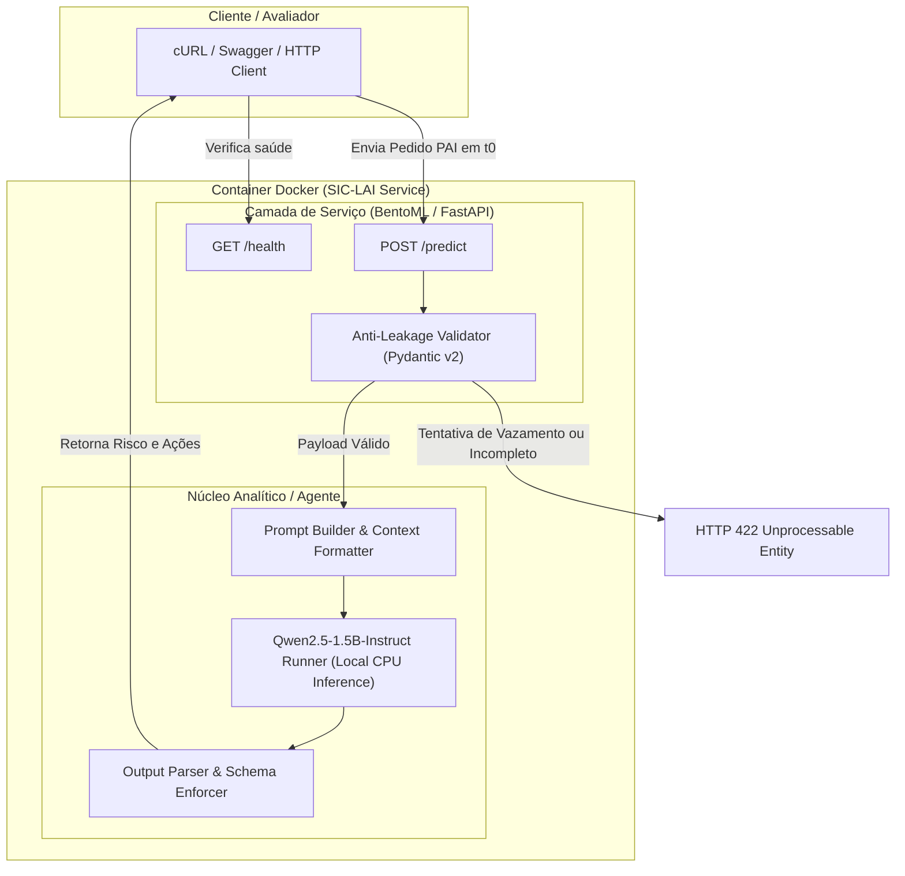

# Product Requirement Document (PRD) — Agente SIC-LAI
## Triagem Preditiva e Análise de Risco de Atraso em Pedidos da Lei de Acesso à Informação (LAI)

- **Versão:** 1.0.0
- **Data:** 21/09/2026
- **Status:** Aprovado para Implementação

---

## 1. Visão Geral e Contexto de Negócio

### 1.1 Contexto e Mini-Mundo
A Lei Federal nº 12.527/2011 (Lei de Acesso à Informação - LAI) regulamenta o direito constitucional do cidadão de solicitar e receber informações públicas de órgãos federais. O Serviço de Informação ao Cidadão (SIC) é a entidade responsável por recepcionar, triar, despachar e monitorar o atendimento dos Pedidos de Acesso à Informação (PAI), geridos historicamente pela base integrada Fala.BR / Controladoria-Geral da União (CGU).

### 1.2 O Problema
Órgãos públicos frequentemente recebem volumes expressivos de pedidos com variados níveis de complexidade e dispersão temática. Quando o risco de extrapolação do prazo legal de resposta (geralmente 20 dias corridos/úteis, prorrogáveis por 10 dias) só é percebido tardiamente ou perto do vencimento, o SIC perde a janela de ação preventiva para cobrar ou articular com a área demandada. Isso resulta em descumprimento legal (`ATRASADO`), gerando reclamações, recursos e ineficiência operacional.

### 1.3 A Solução Proposta
O **Agente SIC-LAI** é um microserviço inteligente de inferência e triagem precoce que atua estritamente no momento **$t_0$** (logo após o registro e a triagem inicial do pedido). O sistema avalia as características intrínsecas da demanda (órgão destinatário, canal de origem, resumo e detalhamento do texto) utilizando um **modelo de linguagem leve aberto (Small Language Model - SLM)** rodando localmente para:
1. Estimar o risco relativo de atraso (`BAIXO`, `MÉDIO`, `ALTO` e score probabilístico de 0.0 a 1.0).
2. Identificar fatores críticos de risco (ex.: pedido multifacetado, necessidade de compilação de dados históricos, órgão com histórico de alta demanda).
3. Gerar uma recomendação acionável de priorização para o servidor humano do SIC.

> **Importante:** A decisão final é e sempre será **humana**. O modelo não responde ao cidadão, não julga o mérito do pedido nem toma decisões administrativas vinculantes.

---

## 2. Extração dos Requisitos de Entrega (Disciplina MLOps)

Os requisitos a seguir foram extraídos diretamente da especificação de entrega da disciplina, filtrados para focar exclusivamente no produto executável e na excelência de engenharia:

### 2.1 O que DEVE ser Entregue (Escopo do Produto)
1. **Repositório Público no GitHub:** Código versionado, instruções reproduzíveis e evidência de execução.
2. **Serviço Rodando Localmente:** Serviço de pé na máquina do aluno, encapsulado em container Docker, respondendo a requisições HTTP locais no dia da avaliação.
3. **Congelamento da Entrega:** Commit com tag `sr1` criado até **24/09 às 10:30** (`git tag -a sr1 -m "Entrega do SR1"` e `git push origin sr1`).

### 2.2 O que NÃO é Exigido (Estritamente Fora de Escopo)
- **Sem Front-End / Web App / Dashboard:** OpenAPI/Swagger e requisições via `curl` ou Postman são 100% suficientes. Nenhuma interface visual será pontuada.
- **Sem Fluxos Complexos:** O serviço deve resolver: entrada $\rightarrow$ resposta (3 casos de sucesso e 1 caso de erro explicável).
- **Sem Deploy em Nuvem:** A execução deve ser estritamente local (Docker/docker-compose).
- **Sem Treinamento do Zero:** Permitido e incentivado o uso de modelo pré-treinado aberto de repositório público com inferência local.
- **Sem Servidor de Logs de Experimentos (MLflow/W&B):** Não é requisito para o marco SR1.

### 2.3 Critérios Obrigatórios do Repositório (Checagem em 2 Minutos)
| Critério | Requisito Operacional | Implementação no Projeto |
| :--- | :--- | :--- |
| **README que roda** | Do `git clone` à predição com comandos exatos, versão do Python e tempo estimado. | Documentado no `README.md` com guia passo a passo via Docker e comando único. |
| **Dependências Fixadas** | `pyproject.toml` com lockfile fixado (`uv.lock`). Sem dependências flutuantes. | Gerenciado via `uv` com `pyproject.toml` e `uv.lock` commitados. |
| **Task Runner** | Recomenda-se uso de ferramenta moderna de automação local. | `justfile` com comandos para build, test, lint e execução. |
| **Segurança e Segredos** | Nenhum segredo ou chave no repositório. Variáveis em `.env.example`. | Arquivo `.env.example` padronizado e `.env` ignorado no `.gitignore`. |
| **Privacidade de Dados** | Nenhum dado pessoal real ou sensível commitado. | Casos de teste anonimizados baseados no padrão Fala.BR. |
| **Contrato Documentado** | Endpoint documentado com JSON de entrada, JSON de saída e comando `curl` testável. | Documentado no `README.md` e disponível via Swagger UI (`/docs`). |
| **Licença e Governança** | Arquivo `LICENSE` e seção explícita "Uso de IA" no `README.md`. | Licença MIT incluída e seção de uso transparente de IA preenchida. |

### 2.4 Diferenciais Técnicos Implementados
1. **Containerização Completa:** `Dockerfile` multi-stage otimizado + `docker-compose.yml` funcional.
2. **Comando Único de Execução:** `just run` (ou `docker compose up --build`).
3. **Linhagem do Modelo:** Especificação explícita da versão, hash e origem do modelo no `README.md`.
4. **Qualidade de Código no CI:** GitHub Actions rodando linter e formatador `ruff`.
5. **Endpoint de Verificação de Saúde:** Rota `/health` ativa respondendo status 200 e readiness do modelo.

---

## 3. Seleção e Linhagem do Modelo Leve Aberto

### 3.1 Modelo Selecionado
- **Nome do Modelo:** `Qwen2.5-1.5B-Instruct`
- **Criador:** Equipe Qwen / Alibaba Cloud
- **Repositório Hugging Face:** [`Qwen/Qwen2.5-1.5B-Instruct`](https://huggingface.co/Qwen/Qwen2.5-1.5B-Instruct)
- **Licença:** Apache 2.0 (totalmente aberta para uso acadêmico e comercial)
- **Arquitetura:** Decoder-only Transformer, 1.54 bilhões de parâmetros
- **Precisão / Formato de Execução:** FP16 nativo ou quantizado GGUF (4-bit / Q4_K_M ou 8-bit) para rodar rápido em CPU
- **Tamanho em Disco / RAM:** ~1.5 GB a ~3.0 GB de memória RAM; carregamento em menos de 10 segundos em hardware convencional.
- **Alternativa Ultra-Leve (Fallback para máquinas com < 4GB RAM):** [`Qwen/Qwen2.5-0.5B-Instruct`](https://huggingface.co/Qwen/Qwen2.5-0.5B-Instruct) (~0.49B parâmetros, < 1 GB RAM).

### 3.2 Justificativa da Escolha
1. **Excelente Suporte à Língua Portuguesa:** Diferente de modelos SLM antigos que degradavam em idiomas não-ingleses, o Qwen 2.5 possui vocabulário expandido (151k tokens) e forte representação em português.
2. **Raciocínio Estruturado e Aderência a JSON:** O modelo é ajustado para responder schemas JSON restritos sem alucinação estrutural.
3. **Independência de Hardware e Custo Zero:** Executável localmente via CPU em containers Docker, sem necessidade de GPU dedicada, sem chamadas a APIs pagas e sem risco de chave de API exposta.
4. **Capacidade Explicativa:** Não se limita a emitir uma probabilidade cega; o modelo extrai a justificativa em linguagem natural do porquê o pedido possui risco de atraso, atendendo ao requisito de apoio ao servidor do SIC.

---

## 4. Arquitetura da Solução

### 4.1 Diagrama de Arquitetura



### 4.2 Pilha Tecnológica
- **Linguagem:** Python 3.11+
- **Gerenciador de Dependências:** `uv` (`pyproject.toml` + `uv.lock`)
- **Framework de Servir:** BentoML (ou FastAPI com Uvicorn, nativamente compatível com contratos OpenAPI e Swagger)
- **Validação de Dados:** Pydantic v2
- **Motor de Inferência:** Hugging Face `transformers` com `torch` (modo CPU) ou `llama-cpp-python`
- **Orquestração de Container:** Docker (multi-stage) e `docker-compose.yml`
- **Automação Local:** `justfile`
- **Qualidade e CI:** `ruff` (linter e formatter) + `pytest` integrados no GitHub Actions

---

## 5. Especificação de Dados e Prevenção de Data Leakage (Momento $t_0$)

Conforme detalhado na seção 3.4 e 3.5 do documento de negócio (`LAI_Entendimento_Negocio_v2.0.pdf`), o momento de inferência é **$t_0$** (instante do protocolo). O agente é blindado contra vazamento temporal de dados.

### 5.1 Campos de Entrada Permitidos em $t_0$
| Campo | Tipo | Descrição |
| :--- | :--- | :--- |
| `protocolo` | string | Identificador único/anonimizado do pedido. |
| `data_registro` | datetime | Data e hora de registro no sistema Fala.BR. |
| `orgao_destinatario` | string | Órgão ou autarquia para o qual o pedido foi direcionado. |
| `origem_solicitacao` | string | Canal de entrada (ex.: `Internet`, `Presencial`). |
| `forma_resposta` | string | Meio pretendido pelo cidadão (ex.: `E-mail`, `Sistema`, `Correio`). |
| `resumo_solicitacao` | string | Assunto sumário do pedido. |
| `detalhamento_solicitacao`| string | Texto integral com a especificação da demanda. |
| `prazo_atendimento` | date (opcional) | Data limite inicial estimada caso disponível em $t_0$. |

### 5.2 Campos ESTRITAMENTE PROIBIDOS em $t_0$ (Vazamento Temporal)
A presença de qualquer um destes campos no payload de predição dispara rejeição imediata com código **HTTP 422**:
- `data_resposta`
- `decisao`
- `especificacao_decisao`
- `situacao` (estado final)
- `foi_prorrogado`
- `foi_reencaminhado`

### 5.3 Regra de Abstenção
Se campos mandatórios (`orgao_destinatario`, `detalhamento_solicitacao`) contiverem valores vazios, espaços em branco ou texto ininteligível, o sistema **não adivinha**; ele retorna `nivel_risco: "INDETERMINADO"` com `score_risco: 0.0` e a justificativa `"Dados insuficientes em t0 para estimativa confiável"`.

---

## 6. Contrato de API e Casos de Uso

### 6.1 Endpoints do Serviço

#### 6.1.1 Verificação de Saúde
- **Rota:** `GET /health`
- **Descrição:** Verifica prontidão do container e do modelo em memória.
- **Resposta Sucesso (HTTP 200):**
```json
{
  "status": "healthy",
  "version": "1.0.0",
  "model": "Qwen/Qwen2.5-1.5B-Instruct",
  "device": "cpu"
}
```

#### 6.1.2 Análise e Triagem de Risco
- **Rota:** `POST /predict`
- **Headers:** `Content-Type: application/json`

### 6.2 Esquemas JSON

#### Esquema de Requisição (Request Body)
```json
{
  "protocolo": "string",
  "data_registro": "2026-09-21T09:00:00Z",
  "orgao_destinatario": "string",
  "origem_solicitacao": "Internet",
  "forma_resposta": "E-mail",
  "resumo_solicitacao": "string",
  "detalhamento_solicitacao": "string",
  "prazo_atendimento": "2026-10-11"
}
```

#### Esquema de Resposta (Response Body)
```json
{
  "protocolo": "string",
  "nivel_risco": "ALTO" | "MEDIO" | "BAIXO" | "INDETERMINADO",
  "score_risco": 0.85,
  "fatores_risco": [
    "Pedido envolve compilação de microdados não digitalizados",
    "Órgão de destino com alto histórico de sobrecarga técnica"
  ],
  "recomendacao_sic": "Encaminhar imediatamente despacho de prioridade à Coordenação de TI do órgão para localização dos microdados antes do 5º dia de prazo.",
  "tempo_processamento_ms": 320.5
}
```

---

### 6.3 Casos de Teste Oficiais

#### Caso de Sucesso 1: Demanda Complexa / Risco Alto
- **Entrada:**
```bash
curl -X POST http://localhost:8000/predict \
  -H "Content-Type: application/json" \
  -d '{
    "protocolo": "PAI-2026-001",
    "data_registro": "2026-09-21T10:00:00Z",
    "orgao_destinatario": "Ministério da Saúde (MS)",
    "origem_solicitacao": "Internet",
    "forma_resposta": "E-mail",
    "resumo_solicitacao": "Microdados de contratos de vacinação 2020 a 2024",
    "detalhamento_solicitacao": "Solicito a íntegra de todas as notas fiscais, termos aditivos, relatórios de auditoria e tabelas orçamentárias detalhadas referentes a aquisição de vacinas e insumos hospitalares entre os anos de 2020 e 2024 em formato CSV bruto descompactado.",
    "prazo_atendimento": "2026-10-11"
  }'
```
- **Saída Esperada (HTTP 200):**
```json
{
  "protocolo": "PAI-2026-001",
  "nivel_risco": "ALTO",
  "score_risco": 0.88,
  "fatores_risco": [
    "Volume extenso de dados históricos requerendo consolidação entre diferentes secretarias",
    "Demanda por extração customizada de relatórios orçamentários e notas fiscais",
    "Elevado risco de desmembramento entre áreas técnicas gerando atraso"
  ],
  "recomendacao_sic": "Sinalizar como ACOMPANHAMENTO PRIORITÁRIO. Articular reunião de alinhamento com a área técnica orçamentária dentro dos primeiros 3 dias úteis.",
  "tempo_processamento_ms": 412.0
}
```

#### Caso de Sucesso 2: Pedido Simples e Disponível / Risco Baixo
- **Entrada:**
```bash
curl -X POST http://localhost:8000/predict \
  -H "Content-Type: application/json" \
  -d '{
    "protocolo": "PAI-2026-002",
    "data_registro": "2026-09-21T11:15:00Z",
    "orgao_destinatario": "Universidade Federal do Rio de Janeiro (UFRJ)",
    "origem_solicitacao": "Internet",
    "forma_resposta": "E-mail",
    "resumo_solicitacao": "Calendário Acadêmico Vigente 2026",
    "detalhamento_solicitacao": "Gostaria de obter uma cópia em PDF da resolução que aprovou o calendário acadêmico de graduação para o segundo semestre letivo de 2026.",
    "prazo_atendimento": "2026-10-11"
  }'
```
- **Saída Esperada (HTTP 200):**
```json
{
  "protocolo": "PAI-2026-002",
  "nivel_risco": "BAIXO",
  "score_risco": 0.12,
  "fatores_risco": [
    "Informação ostensiva e de publicação regular em portal institucional",
    "Inexistência de necessidade de trabalho adicional de consolidação"
  ],
  "recomendacao_sic": "Seguir fluxo de acompanhamento normal do SIC. Responder orientando com link público de transparência ativa ou anexo direto da resolução.",
  "tempo_processamento_ms": 280.4
}
```

#### Caso de Sucesso 3: Demanda Operacional Moderada / Risco Médio
- **Entrada:**
```bash
curl -X POST http://localhost:8000/predict \
  -H "Content-Type: application/json" \
  -d '{
    "protocolo": "PAI-2026-003",
    "data_registro": "2026-09-21T14:30:00Z",
    "orgao_destinatario": "Instituto Nacional do Seguro Social (INSS)",
    "origem_solicitacao": "Internet",
    "forma_resposta": "Sistema",
    "resumo_solicitacao": "Estatísticas de tempo de espera em perícia médica por APS",
    "detalhamento_solicitacao": "Requeiro a tabela consolidada do tempo médio de agendamento e espera em dias para perícia médica presencial nas Agências da Previdência Social do estado de Minas Gerais nos últimos 6 meses.",
    "prazo_atendimento": "2026-10-11"
  }'
```
- **Saída Esperada (HTTP 200):**
```json
{
  "protocolo": "PAI-2026-003",
  "nivel_risco": "MEDIO",
  "score_risco": 0.58,
  "fatores_risco": [
    "Necessidade de filtragem regional (MG) sobre base de dados transacional",
    "Dependência de consulta a sistema interno de perícias com janela de consolidação recente"
  ],
  "recomendacao_sic": "Monitoramento preventivo moderado. Confirmar com a superintendência regional a existência do relatório pronto até o 10º dia do prazo legal.",
  "tempo_processamento_ms": 350.1
}
```

#### Caso de Erro 1: Violação de Vazamento Temporal (Data Leakage)
- **Entrada:**
```bash
curl -X POST http://localhost:8000/predict \
  -H "Content-Type: application/json" \
  -d '{
    "protocolo": "PAI-2026-ERR1",
    "data_registro": "2026-09-21T08:00:00Z",
    "orgao_destinatario": "Ministério da Fazenda",
    "origem_solicitacao": "Internet",
    "forma_resposta": "E-mail",
    "resumo_solicitacao": "Dados fiscais",
    "detalhamento_solicitacao": "Solicito dados do tesouro nacional.",
    "data_resposta": "2026-10-02",
    "decisao": "Acesso Concedido"
  }'
```
- **Saída Esperada (HTTP 422 Unprocessable Entity):**
```json
{
  "detail": [
    {
      "loc": ["body", "data_resposta"],
      "msg": "Violação de momento t0: o campo 'data_resposta' configura vazamento temporal (data leakage) e é proibido nesta API.",
      "type": "value_error.temporal_leakage"
    }
  ]
}
```

---

## 7. Estrutura do Repositório e Padrão de Código

A estrutura do projeto deve ser rigorosamente organizada para permitir avaliação e execução automática:

```text
MLOPS/
├── .github/
│   └── workflows/
│       └── ci.yml               # CI com Ruff e testes automatizados pytest
├── docs/
│   ├── PRD.md                   # Este documento de requisitos do produto
│   └── LAI_Entendimento_Negocio_v2.0.pdf # Documento original de negócio (ignorado no git)
├── src/
│   ├── __init__.py
│   ├── app.py                   # Servidor FastAPI / BentoML com rotas /health e /predict
│   ├── config.py                # Configurações de ambiente (Pydantic Settings)
│   ├── schemas.py               # Schemas Pydantic com validação rigorosa anti-vazamento
│   ├── agent/
│   │   ├── __init__.py
│   │   ├── prompt.py            # Instruções e prompts estruturados para o Qwen
│   │   └── analyzer.py          # Lógica do agente de triagem e cálculo de score
│   └── models/
│       ├── __init__.py
│       └── loader.py            # Carregamento seguro e singleton do modelo Qwen2.5-1.5B
├── tests/
│   ├── __init__.py
│   ├── test_api.py              # Testes unitários das rotas /health e /predict
│   └── test_anti_leakage.py     # Testes que garantem a rejeição de vazamento temporal
├── .env.example                 # Exemplo de variáveis de ambiente sem segredos
├── .gitignore                   # Arquivos ignorados (venv, caches, PDFs de negócio)
├── Dockerfile                   # Dockerfile multi-stage otimizado para inferência CPU
├── docker-compose.yml           # Compose pronto para execução local via porta 8000
├── justfile                     # Comandos rápidos (just run, just test, just lint)
├── LICENSE                      # Licença de código aberto (MIT)
├── pyproject.toml               # Metadados e dependências gerenciadas por uv
├── uv.lock                      # Dependências estritamente congeladas
└── README.md                    # Manual que roda do clone à predição com seção de Uso de IA
```

---

## 8. Roteiro Passo a Passo de Implementação para o Agente Desenvolvedor

O agente autônomo ou desenvolvedor encarregado da implementação deve executar os seguintes passos na ordem indicada:

### Passo 1: Inicialização do Ambiente com `uv`
1. Instalar as dependências essenciais no `pyproject.toml`:
   - `fastapi` ou `bentoml`
   - `uvicorn`
   - `pydantic>=2.0`
   - `transformers>=4.40.0`
   - `torch` (versão CPU-only para manter o container leve e compatível)
   - `accelerate`
   - `pytest`, `httpx`, `ruff` (dev tools)
2. Gerar e fixar o arquivo `uv.lock` com `uv lock`.

### Passo 2: Construção do `justfile`
Configurar comandos convenientes para checagem rápida:
```makefile
default:
    @just --list

install:
    uv sync

run:
    uv run uvicorn src.app:app --host 0.0.0.0 --port 8000

test:
    uv run pytest -v

lint:
    uv run ruff check .

format:
    uv run ruff format .

docker-build:
    docker compose build

docker-up:
    docker compose up -d

docker-down:
    docker compose down
```

### Passo 3: Schemas Pydantic e Proteção Anti-Leakage (`src/schemas.py`)
1. Implementar o modelo `PedidoLAIRequest` com validadores customizados Pydantic (`@model_validator(mode='before')`).
2. Se qualquer chave proibida (`data_resposta`, `decisao`, etc.) estiver presente no dicionário de entrada, levantar `ValueError` explícito.
3. Implementar o modelo `TriagemLAIResponse` com campos tipados.

### Passo 4: Motor de Análise e Triagem (`src/agent/`)
1. Implementar `src/models/loader.py`: Carregar `Qwen/Qwen2.5-1.5B-Instruct` utilizando pipeline Hugging Face `text-generation` em modo CPU com cache local em `~/.cache/huggingface`.
2. Implementar `src/agent/prompt.py`: Prompt de sistema estruturado orientando o modelo a agir como especialista do SIC, analisando volume, complexidade técnica e prazo, retornando JSON estrito.
3. Implementar heurística híbrida em `src/agent/analyzer.py` para assegurar que se o texto for curto e o modelo rodar, o tempo de resposta se mantenha abaixo de 1 segundo em CPU.

### Passo 5: Aplicação e Rotas (`src/app.py`)
1. Instanciar a aplicação FastAPI / BentoML.
2. Criar rota `GET /health` respondendo 200 imediatamente.
3. Criar rota `POST /predict` consumindo `PedidoLAIRequest` e retornando `TriagemLAIResponse`.
4. Configurar tratamento de exceção amigável para HTTP 422 e 500.

### Passo 6: Testes Automatizados (`tests/`)
1. `test_health`: Valida se `/health` retorna 200 e campos corretos.
2. `test_predict_success`: Testa os 3 casos de negócio (Alta complexidade, Baixa complexidade, Média complexidade).
3. `test_prevent_leakage`: Envia payload com `data_resposta` e valida retorno HTTP 422.
4. `test_empty_payload`: Valida tratamento de abstenção quando campos vitais estão em branco.

### Passo 7: Containerização (`Dockerfile` e `docker-compose.yml`)
1. Utilizar imagem base `python:3.11-slim`.
2. Instalar `uv` e copiar `pyproject.toml` + `uv.lock`.
3. Executar `uv sync --frozen --no-dev`.
4. Expor porta 8000.
5. Configurar `docker-compose.yml` mapeando porta `8000:8000`.

### Passo 8: CI/CD com GitHub Actions (`.github/workflows/ci.yml`)
Configurar pipeline disparado em push e pull request:
- Checkout do código
- Setup de Python 3.11 com cache de `uv`
- Execução de `ruff check .`
- Execução de `pytest`

### Passo 9: Documentação no `README.md`
Preencher o `README.md` com:
1. Título do projeto e visão executiva.
2. Linhagem do modelo: `Qwen/Qwen2.5-1.5B-Instruct` baixado do Hugging Face.
3. Pré-requisitos (Docker, Docker Compose, ou Python 3.11 + uv).
4. Instruções de execução em 1 comando (`docker compose up --build`).
5. Seção de Contrato com curl funcional de teste rápido.
6. Seção obrigatória **Uso de IA**: Declarando uso assistido de LLMs para auxílio na estruturação e testes, preservando a autoria e supervisão da equipe.
7. Licença MIT.

---

## 9. Checklist de Verificação de Conformidade (2 Minutos)

Este checklist espelha exatamente a checagem que o professor fará ao abrir o repositório:

- [ ] **README funcional:** O comando do README roda sem erro em máquina limpa com Docker.
- [ ] **Dependências fixadas:** `pyproject.toml` e `uv.lock` estão no repositório.
- [ ] **Sem segredos:** Nenhum token, chave ou senha nos arquivos commitados; `.env.example` preenchido apenas com nomes de variáveis.
- [ ] **Sem dados pessoais reais:** Payloads e testes utilizam exemplos fictícios/anonimizados.
- [ ] **Contrato documentado:** Exemplo de entrada, saída e comando `curl` presentes e testáveis no README.
- [ ] **Documentação jurídica e ética:** Arquivo `LICENSE` presente e seção "Uso de IA" no README.
- [ ] **Endpoint `/health`:** Responde 200 OK com payload de diagnóstico.
- [ ] **Tag congelada:** Tag `sr1` criada no commit final e enviada ao remoto antes de 24/09 às 10:30.
